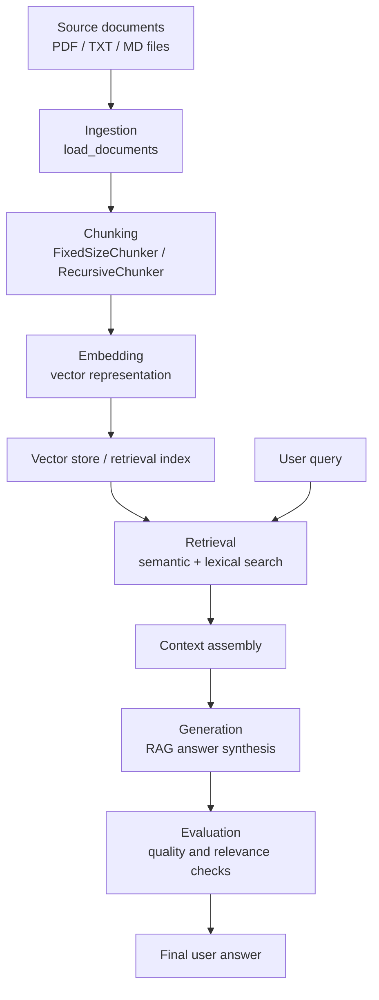
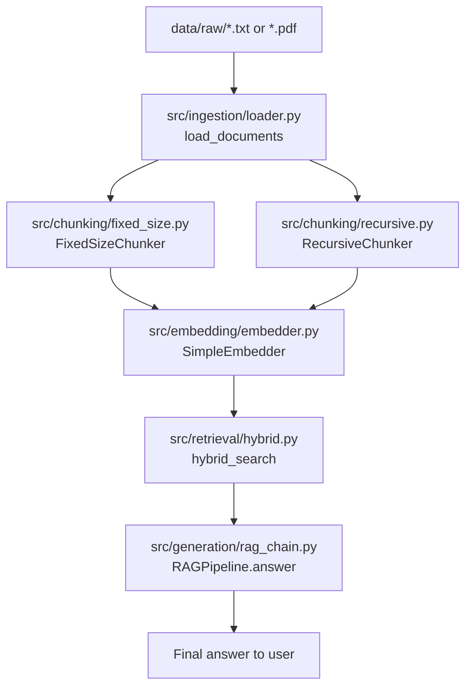

# Diaphragm Material RAG

A lightweight retrieval-augmented generation system for engineering knowledge search and question answering. This project is designed to help teams work with structured and unstructured domain documents, including material specifications, engineering notes, and internal reference content.

The initial domain focus is diaphragm forming and metal alloy knowledge for applications involving ELGILOY (R) and HAVAR (R) Co-Cr-Ni-Mo materials. The repository is organized as a practical, extensible RAG foundation that can be adapted to enterprise document retrieval scenarios.

## Overview

This project demonstrates a simple but useful enterprise pattern:

- load source documents from local files or directories
- normalize and parse the content
- split long documents into searchable chunks
- encode chunks into vector representations
- retrieve the most relevant passages for a query
- synthesize a grounded answer from the retrieved context

This pattern is useful for internal knowledge assistants, technical documentation search, and domain-specific Q&A systems where users need answers grounded in source material.

## Why this project matters

Many organizations store critical information in PDFs, Markdown files, specifications, and internal notes. A RAG workflow helps turn those documents into a searchable knowledge layer that supports faster decision-making and more accurate retrieval.

This repository is intentionally simple and modular so it can be used as:

- a local document Q&A prototype
- a learning project for RAG architecture
- a foundation for a production-ready internal knowledge assistant
- a starting point for enterprise search integrations

## Architecture



The core flow is purposefully straightforward: source documents are ingested, segmented into chunks, converted into vector embeddings, matched against a user query, and used to produce a grounded answer.

### Code-level mapping

- Ingestion: [src/ingestion/loader.py](src/ingestion/loader.py) defines `load_documents`, which loads text and PDF files from files or directories.
- Chunking: [src/chunking/fixed_size.py](src/chunking/fixed_size.py) contains the fixed-size chunker, and [src/chunking/recursive.py](src/chunking/recursive.py) adds recursive sentence-aware segmentation.
- Embedding: [src/embedding/embedder.py](src/embedding/embedder.py) converts text into deterministic vectors.
- Retrieval: [src/retrieval/hybrid.py](src/retrieval/hybrid.py) combines lexical overlap with vector similarity.
- Generation: [src/generation/rag_chain.py](src/generation/rag_chain.py) contains the simple `RAGPipeline` answer logic.

### Module dependency flow



This module flow shows the repository’s implementation path from raw documents to retrieval and answer generation.

## Repository structure

```text
.
|-- config/
|-- data/
|-- docs/
|-- docker/
|-- evaluation/
|-- experiments/
|-- notebooks/
|-- scripts/
|-- src/
|-- tests/
|-- .env.example
|-- .gitignore
|-- LICENSE
|-- Makefile
|-- README.md
|-- create.sh
|-- pyproject.toml
|-- requirements.txt
|-- .venv/
```

## Features

- file and directory ingestion for text-based sources
- PDF ingestion support via `pypdf`
- chunking strategies for long-form document segmentation
- deterministic embedding generation for prototype retrieval
- hybrid retrieval combining lexical and vector scoring
- modular pipeline structure for extension into production systems
- test coverage for chunking, retrieval, embedding, and ingestion

## Quick start

1. Create a virtual environment:

   ```bash
   python -m venv .venv
   source .venv/bin/activate
   ```

2. Install dependencies:

   ```bash
   pip install -r requirements.txt
   ```

3. Run the test suite:

   ```bash
   pytest -q
   ```

4. Run the minimal local-file demo:

   ```bash
   python experiments/01_naive_rag/run.py
   ```

5. Use a custom document source folder:

   ```bash
   python - <<'PY'
   from ingestion.loader import load_documents
   docs = load_documents('data/raw')
   print(len(docs))
   print(docs[0].source)
   PY
   ```

## CLI and Streamlit roles

This project is structured to support both technical and user-facing workflows:

### CLI
The CLI workflow is intended for developers, automation, and internal tooling. It is appropriate for:

- indexing document collections
- running retrieval and answer generation from scripts
- batch processing knowledge content
- integration into backend systems or ETL pipelines

### Streamlit
A Streamlit app is useful when you want a lightweight web-based interface for:

- business users asking questions about internal documents
- product demos and internal Q&A workflows
- low-friction validation of retrieval quality
- rapid prototyping without a full frontend stack

The repository is intentionally modular so the same retrieval stack can power both a command-line workflow and a browser-based interface.

## Environment variables

Copy the example environment file and configure values as needed:

```bash
cp .env.example .env
```

## Roadmap

- integrate a production vector store such as FAISS or pgvector
- add real embeddings via sentence-transformers or OpenAI-compatible APIs
- add a FastAPI service for structured API access
- add a Streamlit-based user interface for demo and internal use
- add end-to-end evaluation metrics for retrieval quality and answer fidelity
- add CI and contribution guidelines for open-source collaboration

## Contributing

Contributions are welcome. The project is designed to be used as a practical foundation for RAG experimentation, production-oriented document search, and internal knowledge tools.

## License

This project is licensed under the MIT License. See [LICENSE](LICENSE).
